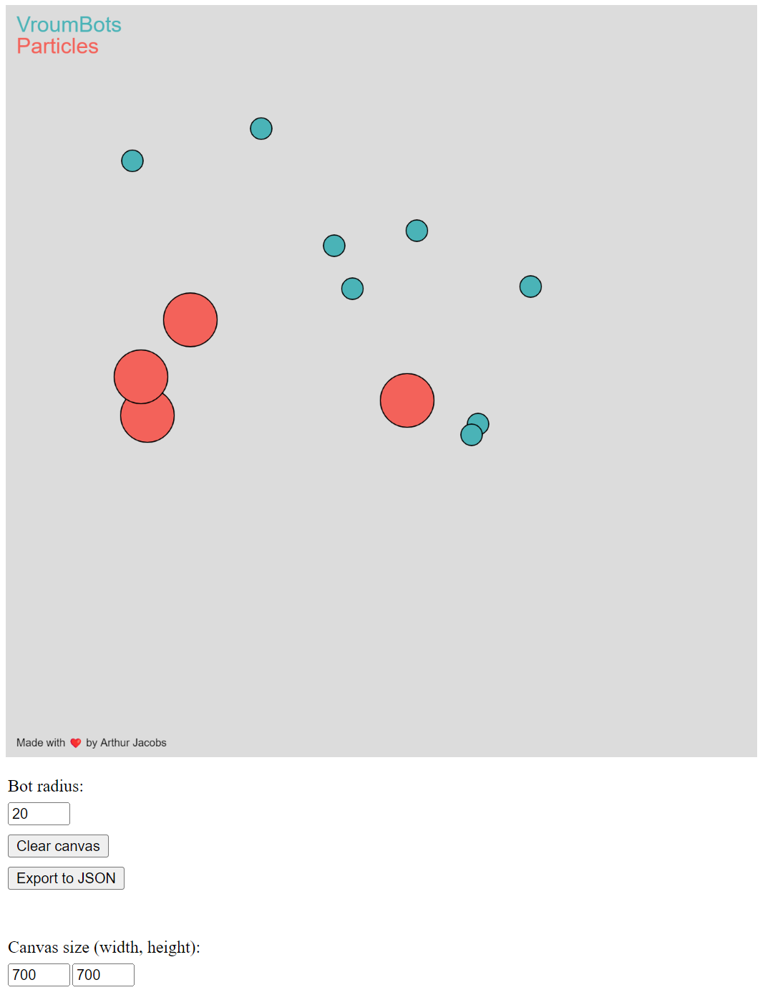

## Initial States Visual Generator for PIN-2024 project

### Quick start

Run this locally to quickly generate custom starting States to test your simulations and strategy on various
environments.

It should look like this:

### More details

You can customize some settings, for ex. the bot radius or the canvas size. Other customizations are on the way.

### TODO:

- Create the random explosion times
- Allow for user to choose robot's captureAngle, inital angle and speeds, particle radius, ...
